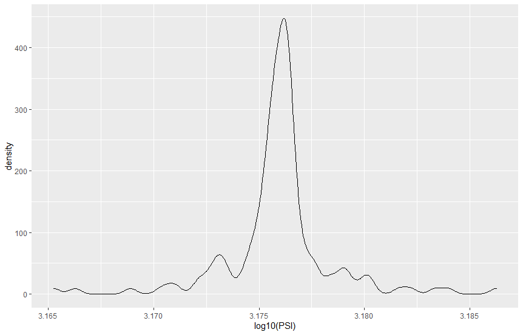

# MechaCar_Statistical_Analysis
Statistical analysis with car data using R
## MPG data
To better predict the fuel efficienct (mpg) dependent variable, other variables of interest are used as independent variables to this multiple linear regression model.  The indepedenat variables are:
- vehicle.length
- vehicle.weight
- spoiler.angle
- ground.clearance
- AWD (all-wheel drive)

The returned coefficients from the model are:
- (Intercept)       5.08e-08
- vehicle.length    2.60e-12
- vehicle.weight    0.0776
- spoiler.angle     0.3069
- ground.clearance  5.21e-08
- AWD               0.1852

The Multple R-squared (coefficient of determination) value is 0.7149 which is a strong positive correlation. This means the slope is positive and not zero.

According to our results, vehicle length and ground clearance (as well as intercept) are statistically unlikely to provide random amounts of variance to the linear model.  This means that vehicle length and ground clearance have a significant impact on fuel efficiency.

## Suspension Coil Data
### Suspension Coil PSI Summary by Manufacturing Lot

- Lot1
-  Mean   1500.018  
-  Median 1500.206  
-  Std. Dev 1.070525  
-  Variance 1.146024

- Lot2  
-  Mean 1499.571  
-  Median 1498.873  
-  Std. Dev 3.183003  
-  Variance 10.131511

- Lot3  
-  Mean 1499.004  
-  Median 1497.981  
-  Std. Dev 14.832753 
-  Variance 220.01056

At first, the test was performed with a group_by on maunfacturing lot number. The variance on Lot3 is outside of this specificatin and should be rejected. I expected the one sample population test to be rejected also but it was not.  Still, there is a problem with Lot3 that should be investigated.

### Suspension Coil Summary Entire Population
- Mean 1499.531  
- Median 1499.747
- Std. Dev 8.731242
- Variance 76.23459

The design specifications for the suspension coils dictate that the variance of the coils not exceed 100 pounds per inch. The variance of the population meets this specification.

### Density Plot

### One Sample T-test
Hypotheses:
- H0 : There is no statistical difference between the observed sample mean and its presumed population mean
- 	Ha : There is a statistical difference between the observed sample mean and its presumed population mean

With a 50 data point sample: 
- data:  log10(sample_table$PSI)
- t = -1.0173, df = 49, p-value = 0.314
- alternative hypothesis: true mean is not equal to 3.175948
- 95 percent confidence interval: 3.174871 3.176301
- sample estimates: mean of x  3.175586 

For this test, the p-value of a 50 point sample is 0.314 which way above the common 0.05 percent.  Therefore, the null hypothesis 
is accepted and we can state that the two means are statistically similar.
 
## Design A Study
Metrics to Study that are of interest to a consumer:
- MSRP
- Fuel Efficiency - categorized
- HorsePower - categorized
- Safety Features - categorized

Questions?
- How does MSRP affect fuel efficiency?
- How does Horsepower affect fuel efficiency?
- How do number of safety features affect fuel efficiency?

Same hypotheses for all questions:
- Ho: The means of all groups are equal: mu1 = mmu2=...=mun
- Ha: At least one of the means is differen from all other groups.

Use ANOVA test (two-way) since independent variabe is categorical and dependent variable is continuous. Find out if there is a statistical difference between the distribution means from multiple samples.

Also, there are multiple categorical variab les tightly linked so use Chi-squared test to find out if there is a statistical difference in distribution of category or is the data explained by random distriubtion.

Collect the data for the four metrics across for 10 best-selling cars in the same category as MechaCar prototyes.

## Resources

data: 
MechaCar_mpg.csv, Suspension_Coil.csv

Software Used:
- R with Libraries: tidyverse, dplyr, ggplot
- RStudio